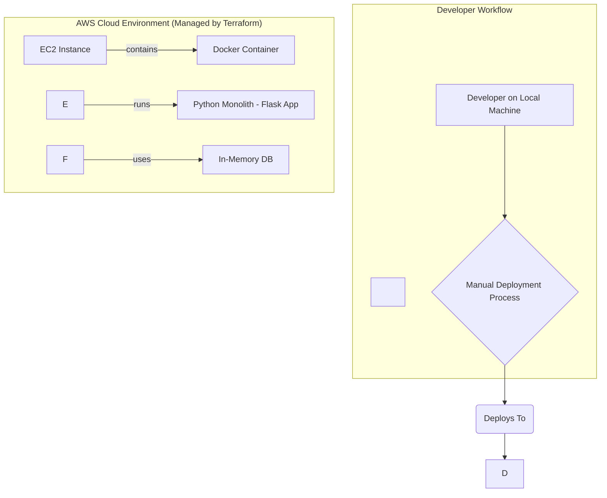
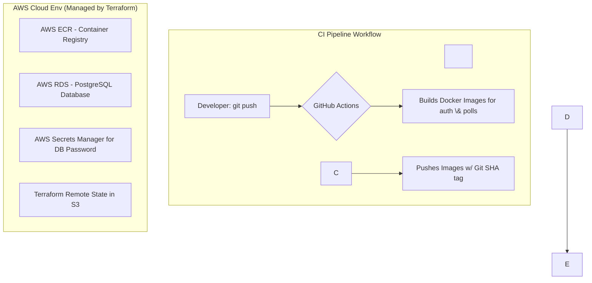

\# Phase 1: The Monolithic Foundation

\## Goal: 

Establish a solid, functional baseline by manually deploying a single, containerized application to the cloud using Infrastructure as Code.

\## Architecture:

\## Key Accomplishments:

\### 1. Infrastructure as Code (IaC): 

Used Terraform to provision a custom VPC, subnet, security groups, and a single EC2 instance.

\### 2. Containerization: 

Packaged the Python Flask application into a portable image using a Dockerfile.

\### 3. Monolithic Application: 

Developed a single Python Flask app with all user and poll logic, using an in-memory dictionary for data storage.

\### 4. Manual Deployment Baseline: 

Established a manual workflow (SSH, git clone, docker build/run) to serve as a benchmark for future automation.

\_\_\_\_\_\_\_\_\_\_\_\_\_\_\_\_\_\_\_\_\_\_\_\_\_\_\_\_\_\_\_\_\_\_\_\_\_\_\_\_\_\_\_\_\_\_\_\_\_\_\_\_\_\_\_\_\_\_\_\_\_\_\_\_\_\_\_\_\_\_\_\_\_\_\_\_\_\_\_\_\_\_\_\_\_\_\_\_\_\_\_\_\_\_\_\_\_\_\_\_\_\_\_\_\_\_\_\_\_\_\_\_\_\_\_\_\_\_\_\_\_\_\_\_\_\_\_\_\_\_\_\_\_\_\_\_\_\_\_\_\_\_\_\_\_\_\_\_\_\_\_\_\_\_\_\_\_\_\_\_\_\_\_\_\_\_\_\_\_\_\_\_\_\_\_\_\_\_\_\_\_\_\_\_\_\_\_\_\_\_\_\_\_\_\_\_\_\_\_\_\_\_\_\_\_\_\_\_\_\_\_\_\_\_\_\_\_\_\_\_\_\_\_\_\_\_\_\_\_\_\_\_\_\_\_\_\_\_\_\_\_\_\_\_\_\_\_\_\_\_\_\_\_\_\_\_\_\_\_\_\_\_\_\_\_\_\_\_\_\_\_\_\_\_\_

\# Phase 2: Microservices, CI/CD, and a Cloud Foundation

\## Goal: Evolve the project into a professional, multi-service application with a real database and a fully automated Continuous Integration pipeline.

\## Architecture:

\## A. Key Accomplishments:

\### 1. Microservices Architecture: 

Refactored the monolith into two services: auth-service and polls-service.

\### 2. Production-Grade Database: 

Provisioned a managed AWS RDS (PostgreSQL) instance.

\### 3. Automated Continuous Integration (CI): 

Built a GitHub Actions pipeline that automatically builds and pushes Docker images to AWS ECR (Elastic Container Registry) 

on every commit.

\## B. Advanced IaC:

\### 1. Remote State: 

Migrated Terraform state to an AWS S3 bucket for security and collaboration.

\### 2. State Locking: 

Implemented a DynamoDB table to prevent concurrent state modifications.

\## C. Enhanced Security:

\### 1. Secrets Management: 

Integrated AWS Secrets Manager to handle the RDS database password.

\### 2. Network Hardening: 

Restricted SSH access in the security group to the developer's dynamic IP address.

\### 3. Strategic Decoupling: 

The Deploy to EC2 step was intentionally commented out, transforming the pipeline into a "CI-Only" workflow. 

\## D. Strategic Shift: A CI-Only Pipeline (Preparing for Phase 3)

As part of the transition toward a Kubernetes-based architecture, the `Deploy to EC2` step in the `deploy.yml` workflow has been \*\*temporarily commented out\*\*.

This is a deliberate architectural decision to \*\*decouple Continuous Integration (CI) from Continuous Deployment (CD)\*\*. The sole responsibility of the current pipeline is to perform 

CI: build, test, and package the application into a versioned, deployable artifact (a Docker image stored in ECR).

This leaves the project in a clean, state-of-the-art position where our ECR images are environment-agnostic and ready to be deployed to any target, which in Phase 3 will be an AWS EKS cluster. 

Its sole job is to produce a versioned, deployable artifact (the Docker image), preparing the project for any deployment target, such as Kubernetes in Phase 3.

