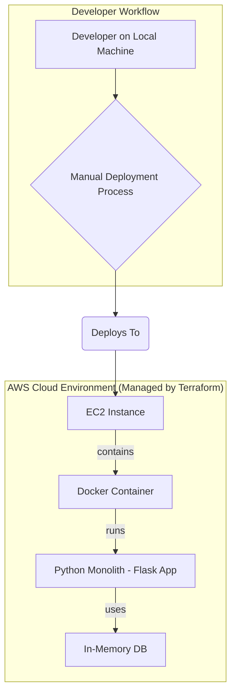
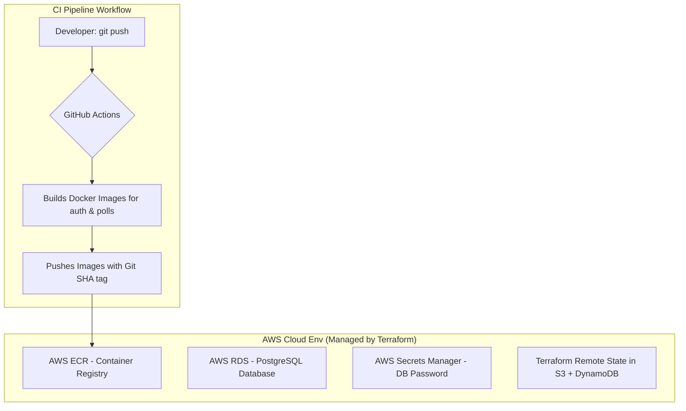

# 📘 VoteWave Documentation

This file documents the project’s evolution across phases, including goals, architecture, and accomplishments.

---

# 🌱 Phase 1: The Monolithic Foundation

## 🎯 Goal
Establish a functional baseline by manually deploying a single containerized application to the cloud using Infrastructure as Code.

## 🏗️ Architecture

---
## ✅ Key Accomplishments
### 1. Infrastructure as Code (IaC)
- Used Terraform to provision a custom VPC, subnet, security groups, and a single EC2 instance.

### 2. Containerization
- Packaged the Python Flask application into a portable image using a Dockerfile.

### 3. Monolithic Application
- Developed a single Python Flask app with all user and poll logic.
- Used an in-memory dictionary for data storage.

### 4. Manual Deployment Baseline
- Established a manual workflow (SSH → git clone → docker build/run) as a benchmark for automation.
---

# 🌊 Phase 2: Microservices, CI/CD, and a Cloud Foundation

## 🎯 Goal
Evolve the project into a professional, multi-service application with a real database and a fully automated CI/CD pipeline.

## 🏗️ Architecture

## 🅰️ Key Accomplishments
### 1. Microservices Architecture
Refactored the monolith into two services:

- auth-service
- polls-service

### 2. Production-Grade Database
Provisioned an AWS RDS PostgreSQL instance.

### 3. Automated CI
- Built a GitHub Actions pipeline to:
- Build Docker images
- Tag them with the Git SHA
- Push them to AWS ECR automatically on every commit.

## 🅱️ Advanced IaC
### 1. Remote State
Migrated Terraform state to AWS S3 for security and collaboration.

### 2. State Locking
Added DynamoDB table to prevent concurrent state modifications.

## 🔐 Enhanced Security
### 1. Secrets Management
Integrated AWS Secrets Manager for RDS database password.

### 2. Network Hardening
Restricted SSH access in the security group to the developer’s dynamic IP.

### 3. Strategic Decoupling
The Deploy to EC2 step was commented out → pipeline now focuses only on CI.

## ⚡ Strategic Shift: CI-Only Pipeline (Preparing for Phase 3)
- Deployment to EC2 was deliberately removed from the pipeline.
- Current pipeline responsibility: Continuous Integration only → build, test, and push versioned Docker images to ECR.
- These images are environment-agnostic → ready for any target environment.
- Prepares the foundation for Phase 3, where deployment will move to AWS EKS (Kubernetes).
