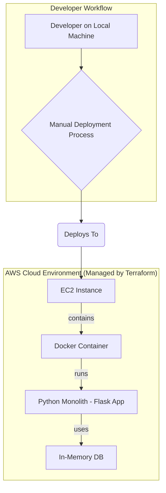
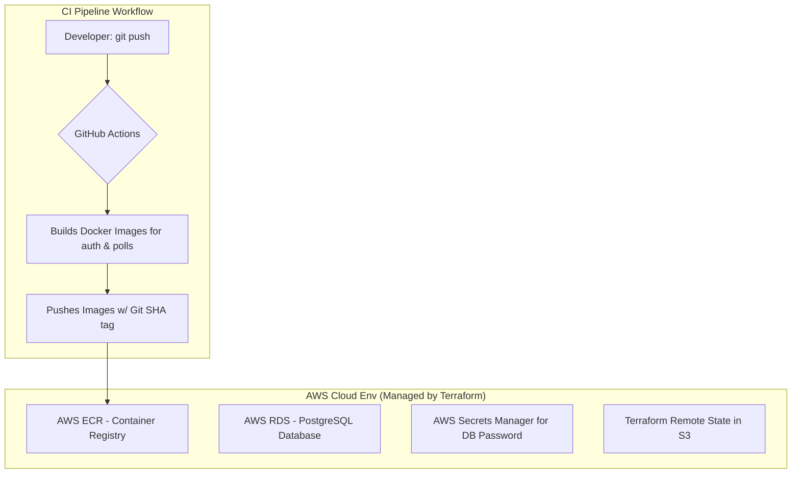

# VoteWave: A Cloud-Native DevOps Capstone Project

VoteWave is a comprehensive portfolio project designed to showcase a full range of modern DevOps skills. The project starts as a simple, manually-deployed application and iteratively evolves into a fully automated, scalable, and observable microservices-based system running on AWS. This document outlines the project's architecture, how to run it, and the journey through its developmental phases.

## How to Run VoteWave (Current : Phase 2 State)

This guide will help you deploy the complete Phase 2 infrastructure and CI pipeline.

### Prerequisites

*   An AWS Account
*   AWS CLI installed and configured (`aws configure`)
*   Terraform installed
*   Git installed
*   An existing SSH key pair in `~/.ssh/` (e.g., `tf-aws-key.pub`)

## Step 1: Clone the Repository

git clone <your-repository-url>
_cd VoteWave_

## Step 2: Provision the Terraform Backend
The remote backend (S3 bucket and DynamoDB table) must be created first.

### Step 2.1 : Navigate to the backend setup directory
_cd terraform-backend_

### Step 2.2 : IMPORTANT: Open main.tf and change the S3 bucket name to something globally unique.
_nano main.tf_ 

### Step 2.3 : Initialize and create the backend resources
_terraform init
terraform apply --auto-approve_

### Step 2.4 : Navigate back to the main project directory
_cd .._

## Step 3: Provision the Main Infrastructure
Now, provision the core application infrastructure (VPC, EC2, RDS, ECR, etc.).

### Step 3.1 : Navigate to the main infrastructure directory
_cd infra
_
### Step 3.2 : Initialize Terraform to connect to your remote S3 backend
_terraform init
_
### Step 3.3 : Apply the configuration to build the infrastructure
_terraform apply --auto-approve_

## Step 4: Configure GitHub Secrets
For the CI pipeline to work, you must add the following secrets to your GitHub repository under Settings > Secrets and variables > Actions.

**_AWS_ACCESS_KEY_ID_**: Your AWS IAM user access key.
_**AWS_SECRET_ACCESS_KEY**_: Your AWS IAM user secret key.
**_AWS_ACCOUNT_ID_**: Your 12-digit AWS Account ID.

## Step 5: Trigger the CI Pipeline
The pipeline is configured to run on every push to the main branch. Make a small change, commit, and push the code.

### Example of a small change
echo "# Test commit" >> README.md
git add .
git commit -m "feat: Trigger CI pipeline"
git push origin main

You can now go to the Actions tab in your GitHub repository to watch the pipeline build your Docker images and push them to ECR.

## Project Journey & Evolution
The project is being built iteratively in four distinct phases, each layering on new skills and technologies.
_____________________________________________________________________________________________________________________________________________________________________________________________________________________________

# Phase 1: The Monolithic Foundation

## Goal: 
Establish a solid, functional baseline by manually deploying a single, containerized application to the cloud using Infrastructure as Code.

## Architecture:

## Key Accomplishments:
### 1. Infrastructure as Code (IaC): 
Used Terraform to provision a custom VPC, subnet, security groups, and a single EC2 instance.
### 2. Containerization: 
Packaged the Python Flask application into a portable image using a Dockerfile.
### 3. Monolithic Application: 
Developed a single Python Flask app with all user and poll logic, using an in-memory dictionary for data storage.
### 4. Manual Deployment Baseline: 
Established a manual workflow (SSH, git clone, docker build/run) to serve as a benchmark for future automation.
___________________________________________________________________________________________________________________________________________________________________________________________________________________________________________________________________________________

# Phase 2: Microservices, CI/CD, and a Cloud Foundation
## Goal: Evolve the project into a professional, multi-service application with a real database and a fully automated Continuous Integration pipeline.
## Architecture:

## A. Key Accomplishments:
### 1. Microservices Architecture: 
Refactored the monolith into two services: auth-service and polls-service.
### 2. Production-Grade Database: 
Provisioned a managed AWS RDS (PostgreSQL) instance.
### 3. Automated Continuous Integration (CI): 
Built a GitHub Actions pipeline that automatically builds and pushes Docker images to AWS ECR (Elastic Container Registry) 
on every commit.

## B. Advanced IaC:
### 1. Remote State: 
Migrated Terraform state to an AWS S3 bucket for security and collaboration.
### 2. State Locking: 
Implemented a DynamoDB table to prevent concurrent state modifications.

## C. Enhanced Security:
### 1. Secrets Management: 
Integrated AWS Secrets Manager to handle the RDS database password.
### 2. Network Hardening: 
Restricted SSH access in the security group to the developer's dynamic IP address.
### 3. Strategic Decoupling: 
The Deploy to EC2 step was intentionally commented out, transforming the pipeline into a "CI-Only" workflow. 

## D. Strategic Shift: A CI-Only Pipeline (Preparing for Phase 3)
As part of the transition toward a Kubernetes-based architecture, the `Deploy to EC2` step in the `deploy.yml` workflow has been **temporarily commented out**.

This is a deliberate architectural decision to **decouple Continuous Integration (CI) from Continuous Deployment (CD)**. The sole responsibility of the current pipeline is to perform 
CI: build, test, and package the application into a versioned, deployable artifact (a Docker image stored in ECR).
This leaves the project in a clean, state-of-the-art position where our ECR images are environment-agnostic and ready to be deployed to any target, which in Phase 3 will be an AWS EKS cluster. 
Its sole job is to produce a versioned, deployable artifact (the Docker image), preparing the project for any deployment target, such as Kubernetes in Phase 3.
