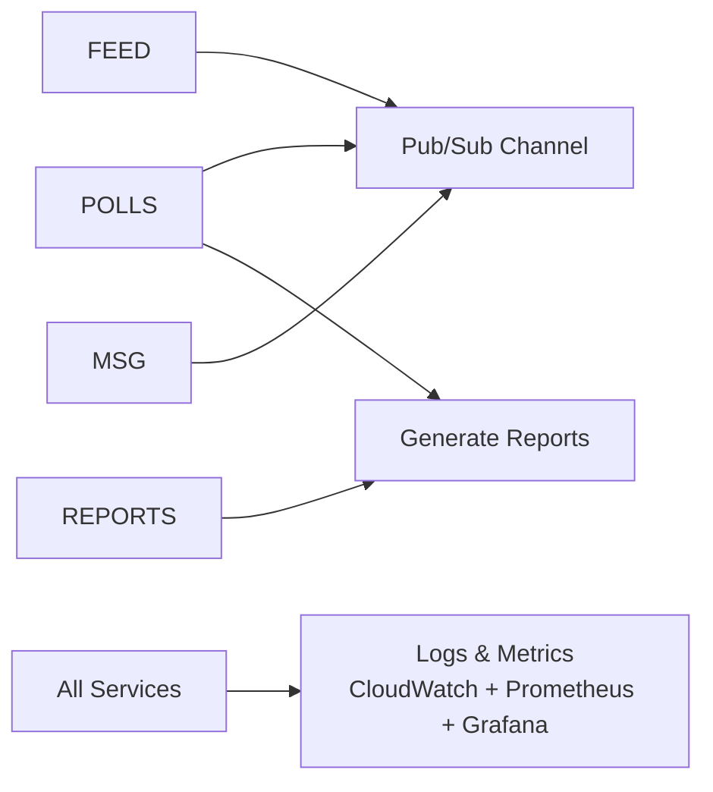
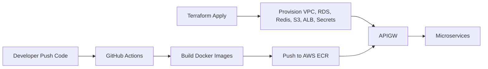
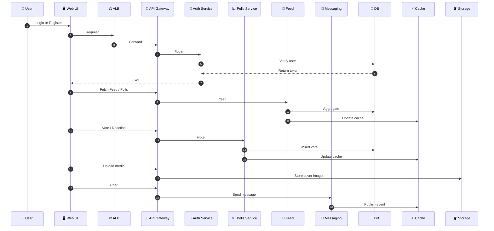
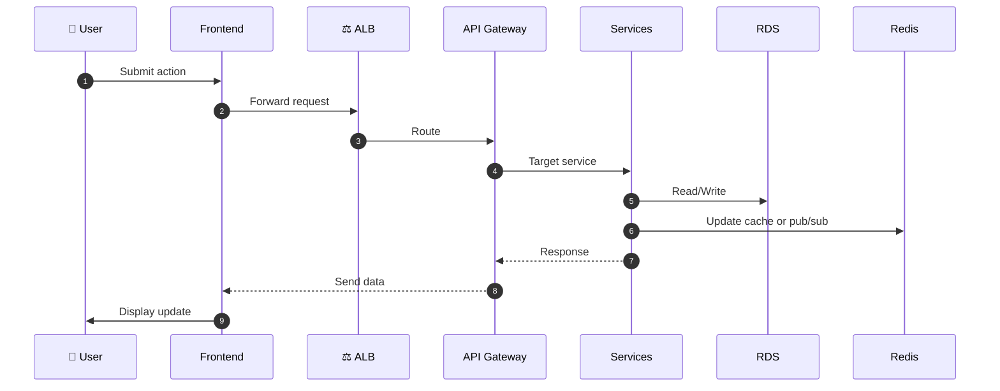
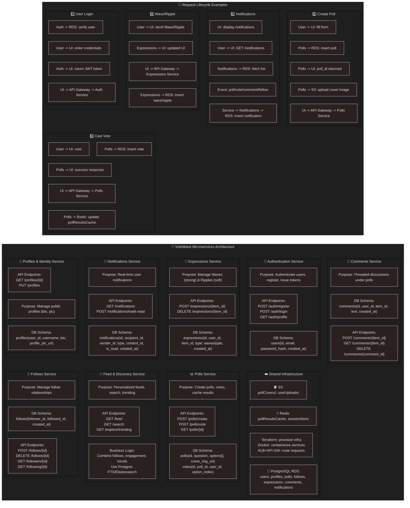
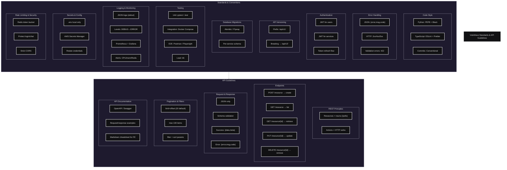

# VoteWave : Cloud-Native Polling App

<p align="center">
  <!-- Project Status -->
  &nbsp;&nbsp;

  <!-- Contributions -->
  <a href="https://github.com/MrCh0p808/AnnaSewa?tab=readme-ov-file#-contribution">
  
  </a>&nbsp;&nbsp;
  <!-- LinkedIn -->
  <a href="https://www.linkedin.com/in/trideev-ganguly/">
    
  </a>&nbsp;&nbsp;
  <!-- LICENSE -->
  <a href="https://github.com/MrCh0p808/VoteWave/blob/main/LICENSE]">
    
  </a>&nbsp;&nbsp;
  <!-- Made With Love -->
  <a href="https://img.shields.io/badge/Made%20with-❤️-red.svg">
    
  </a>&nbsp;&nbsp;
</p>
<p align="center">
  <!-- Frontend -->
  <a href="https://react.dev/">
    
  </a>
  <!-- Backend -->
  <a href="https://www.python.org/doc/">
    
  </a>
  <a href="https://fastapi.tiangolo.com/">
    
  </a>
  <a href="#">
    
  </a>
  <!-- Cloud + Infra -->
  <a href="https://aws.amazon.com/">
    
  </a>
  <a href="https://aws.amazon.com/">
    
  </a>
  <a href="https://docs.aws.amazon.com/eks/">
    
  </a>
  <a href="https://developer.hashicorp.com/terraform/docs">
    
  </a>
  <a href="https://docs.docker.com/">
    
  </a>
  <a href="https://kubernetes.io/docs/">
    
  </a>
  <a href="https://docs.github.com/en/actions">
    
  </a>

  <!-- Monitoring -->
  <a href="https://docs.aws.amazon.com/cloudwatch/">
    
  </a>
  <a href="https://grafana.com/docs/">
    
  </a>
</p>

---

Welcome to **VoteWave**, my *Dhaansu* Terraform project for deploying a cloud-native polling/voting app on **AWS EC2** and **RDS Postgres**!  
This repo automates the **entire infrastructure lifecycle**, from networking and security to compute, storage, schema initialization, and full observability.

---

## 📂 What's Inside?

- 📖 **[STORY.md](docs/STORY.md)** – The journey, story, and vision behind VoteWave  
- ⚙️ **[SETUP.md](docs/SETUP.md)** – Step-by-step setup and deployment guide  
- 📑 **[DOCS.md](docs/DOCS.md)** – Phase-wise development and infrastructure documentation  

---

## Expanded Architecture (September–October 2025)

VoteWave’s architecture is a full-stack playground where every piece talks cleanly to each other.

### 1. External Layer: 
Users and admins access a React + TypeScript UI handling login, profiles, polls, feeds, notifications, VoteBooth, and chat. State manages sessions, feeds, votes, and profiles, while API requests carry JWTs via axios/fetch.

### 2. Public Infrastructure: 
Requests hit an Application Load Balancer in the public subnet, then route to a private API Gateway. Security is tight -only allowed sources reach backend services on ports 5001–5002.

### 3. Private Services: 
Microservices sit behind the gateway:

- Auth (login/profile), Profiles (metadata), Polls (create/vote/cache)
- Follows, Expressions, Comments, Feed, Notifications, VoteBooth, Messaging
- Planned services: Reactions, Reports

### 4. Shared Cloud Resources: 
PostgreSQL RDS stores relational data, Redis handles caching and pub/sub, and S3 stores media. Observability via CloudWatch, Prometheus, and Grafana tracks metrics, alerts, and traces.

### 5. Infra & Dev Builds: 
Terraform provisions VPCs, subnets, security groups, databases, and caches. Docker Compose spins up local environments mirroring production.

### 6. Service Flow: 
User → UI → API → ALB → API Gateway → microservices → shared resources. Every service knows where to get data, cache results, and push updates.

<p>This setup is both sandbox and production-ready. I can iterate fast, scale services independently, monitor everything, and add new microservices, analytics, or reactions seamlessly. VoteWave is now a living ecosystem of microservices, cloud infra, and observability working together effortlessly.

I want this diagram to reflect **all planned microservices**, the shared infra, observability, and dependencies.</p>

```mermaid
---
config:
  theme: dark
  layout: elk
  look: classic
---
flowchart LR
 subgraph EXT["🌍 External Systems (Public Internet)"]
        USER(["End User / Admin"])
  end
 subgraph FE["🖥️ Frontend (React + TypeScript)  - Public"]
        UI(["Web UI\nLogin, Profile, Polls, Feed, Notifications, VoteBooth, Chat"])
        API(["API Client Layer\naxios/fetch\nHandles JWT"])
        STATE(["React State\nSession, Feed, PollVote, Profile"])
  end
 subgraph PUB["Public Subnet"]
        ALB[/"Application Load Balancer\nRoutes to API Gateway"/]
  end
 subgraph PRIV["Private Subnet"]
        APIGW[/"API Gateway\nAuthorizes + Routes Requests"/]
        SGNOTE(["Security Groups:\nOnly ALB or VPC CIDR\nPorts 5001–5002"])
  end
 subgraph NET["🏗️ Networking + Infrastructure"]
        TF{{"Terraform - IaC\nCreates VPC, Subnets, SGs, RDS, Redis, S3"}}
        DOCKER{{"Docker Compose / Dev Builds"}}
  end
 subgraph SERVICES["🛠️ Microservices & Planned Services"]
        AUTH["🔐 Auth Service\nLogin/Register/Profile"]
        PROF["👤 Profiles\nUser Profiles & Metadata"]
        POLLS["📊 Polls\nCreate, Vote, Cache Results"]
        FOL["🔗 Follows\nFollow/Unfollow/List"]
        EXPR["🌊 Expressions\nWave/Ripple"]
        COMM["💬 Comments\nThreaded Poll Comments"]
        FEED["📰 Feed & Discovery\nPersonalized feed, search, trends"]
        NOTIF["🔔 Notifications\nList/Mark Read"]
        BOOTH["🏛️ VoteBooth\nPin Poll, Join Booth"]
        MSG["💬 Messaging\nWebSocket Chat / PubSub"]
        REACTIONS["❤️ Reactions Service (Planned)\nLike / Clap / Emoji"]
        REPORTS["📈 Reports Service (Planned)\nAnalytics / Election Reports"]
  end
 subgraph SHARED["☁️ Shared Cloud Resources  - Private"]
        RDS[("🐘 PostgreSQL RDS\nUsers, Profiles, Polls, Follows, Expressions, Comments, Notifications")]
        REDIS{{"⚡ Redis Cache\nPollResults, SessionStore, Pub/Sub"}}
        S3[["🪣 S3 Buckets\npollCovers/, userUploads/"]]
        OBS["🔭 Observability\nCloudWatch + Prometheus + Grafana"]
  end
    USER --> UI
    UI --> API
    API --> ALB
    ALB --> APIGW
    APIGW --> AUTH & PROF & POLLS & FOL & EXPR & COMM & FEED & NOTIF & BOOTH & MSG & REACTIONS & REPORTS
    AUTH --> RDS
    PROF --> RDS
    POLLS --> RDS & S3 & REDIS
    FOL --> RDS
    EXPR --> RDS
    COMM --> RDS
    FEED --> RDS & REDIS
    NOTIF --> RDS
    BOOTH --> RDS
    MSG --> RDS & REDIS
    REACTIONS --> RDS
    REPORTS --> RDS & S3
    SHARED --> RDS & REDIS & S3 & OBS
    TF --> SHARED
    DOCKER --> AUTH & PROF & POLLS & FOL & EXPR & COMM & FEED & NOTIF & BOOTH & MSG
    caption["VoteWave  - Full Microservices Architecture + Shared Infra + Observability Layer"]
````

---

## 🧭 VoteWave Architecture Evolution (Old vs New)

```mermaid
flowchart LR
subgraph OLD["🌊 Phase 2 — Early Microservices + Basic Standards"]
direction TB
  OARCH["🏗️ Architecture<br>EC2 + RDS + S3 + Terraform (v1)"]
  OAUTH["🔐 Auth Service<br>Login / Register / JWT"]
  OPROF["👤 Profiles Service<br>Public Profile / Pic"]
  OPOLLS["📊 Polls Service<br>Polls + Votes"]
  OFOL["🔗 Follows Service"]
  OEXPR["🌊 Expressions Service"]
  OCOMM["💬 Comments Service"]
  OFEED["📰 Feed Service<br>Trending + Search"]
  ONOTIF["🔔 Notifications Service"]
  OINFRA["☁️ Infra<br>Terraform + Docker + ALB"]
  OSTD["📜 API Standards<br>PEP8 • REST nouns • JWT users<br>No observability"]
end

%% Spacer to visually separate columns
EMPTY[ ]

subgraph NEW["☁️ Phase 3 — Cloud-Native + Evolved Standards"]
direction TB
  NARCH["🏗️ Architecture<br>Terraform Full Stack + Private Subnets<br>ECR → ECS/EKS Pipeline"]
  NAUTH["🔐 Auth v2<br>Refresh Tokens + Secrets Rotation"]
  NPROF["👤 Profiles v2<br>Audit Logs → CloudWatch"]
  NPOLLS["📊 Polls v2<br>Redis Cache + S3 Covers + Event Hooks"]
  NFOL["🔗 Follows v2<br>Streams → Feed"]
  NEXPR["🌊 Expressions v2<br>Metrics → Prometheus"]
  NCOMM["💬 Comments v2<br>Moderation + Soft Delete"]
  NFEED["📰 Feed v2<br>Redis + Search Engine (FTS)"]
  NNOTIF["🔔 Notifications v2<br>Async Jobs + Bulk API"]
  NBOOTH["🏛 VoteBooth (New)<br>Realtime Poll Rooms"]
  NMSG["💬 Messaging (New)<br>WebSockets + Redis Pub/Sub"]
  NREACT["😀 Reactions (New)<br>Likes / Claps / Emoji"]
  NREPORTS["📈 Reports (New)<br>Aggregated Analytics → S3"]
  NOBS["🔭 Observability Layer<br>CloudWatch + Prometheus + Grafana"]
  NSEC["🔐 Security & IAM<br>AWS Secrets Manager + SG Hardening"]
  NSTD["📜 API Standards v2<br>OpenAPI • Trace IDs • Rate Limits • Grafana Metrics"]
end

%% Connections between old and new
OARCH --> NARCH
OAUTH --> NAUTH
OPROF --> NPROF
OPOLLS --> NPOLLS
OFOL --> NFOL
OEXPR --> NEXPR
OCOMM --> NCOMM
OFEED --> NFEED
ONOTIF --> NNOTIF
OINFRA --> NOBS
OSTD --> NSTD

%% Newly added services
NBOOTH -. Added .-> NMSG
NMSG -. Realtime Chat .-> NOBS
NREACT -. Reactions .-> NREPORTS
NREPORTS -. Analytics .-> NOBS
NSEC -. Security Upgrade .-> NARCH

%% Style
classDef old fill:#ffe8c6,stroke:#555,color:#000
classDef new fill:#c2ffd8,stroke:#333,color:#000
class OARCH,OAUTH,OPROF,OPOLLS,OFOL,OEXPR,OCOMM,OFEED,ONOTIF,OINFRA,OSTD old
class NARCH,NAUTH,NPROF,NPOLLS,NFOL,NEXPR,NCOMM,NFEED,NNOTIF,NBOOTH,NMSG,NREACT,NREPORTS,NOBS,NSEC,NSTD new

```

## Microservice Dependencies & Observability

This part maps how VoteWave’s microservices talk to shared resources and how we keep everything observable.

### 1. Polls Service: 
Caches poll results in Redis for fast retrieval and stores poll cover images in S3. This keeps the app responsive and media persistent.
### 2. Feed Service: 
Uses Redis to cache personalized feeds, so users get near-instant updates without hammering the database.
### 3. Messaging Service: 
Relies on Redis pub/sub channels to handle real-time chat, keeping messages flowing smoothly.
### 4. Reports Service (Planned): 
Pulls data from S3 to generate analytics and election reports without stressing the core database.
### 5. Observability: 
Every service -literally all of them -pushes logs and metrics to CloudWatch, Prometheus, and Grafana. 
That means I can see everything from API performance to cache hits, trace requests across services, and set alerts for any hiccups.

<p>Basically, Redis and S3 act like the shared brain and storage for microservices, while CloudWatch, Prometheus, and Grafana give me full visibility into the system. The services are decoupled but still talk cleanly through these shared resources, making debugging, scaling, and monitoring super smooth.</p>



---

## CI/CD & Terraform Interaction

I wanted Terraform to provision infra and GitHub Actions to handle builds and deployments, all in sync.



---

## End-to-End Request Flow (Expanded)



---

## End-to-End Request LifeCycle



---
## ⚡ Recommended Setup

### Export AWS Credentials
```bash
export AWS_ACCESS_KEY_ID="your_access_key"
export AWS_SECRET_ACCESS_KEY="your_secret_key"
```

Ensure your local machine has Terraform installed (terraform -v).

Follow **[SETUP.md](docs/SETUP.md)** for detailed deployment instructions.

## MicroServices At Glance

## STANDARDS & API GUIDELINES


## 🤝 Contributing

- Got ideas or improvements?
- Fork the repo
- Create a new branch
- Submit a PR 🎉
- Or ping me directly on LinkedIn [Trideev Ganguly](https://www.linkedin.com/in/trideev-ganguly/) to discuss the project!

## 📜 License

This project is open-source under the [MIT LICENSE](https://github.com/MrCh0p808/VoteWave/blob/main/LICENSE)
.

## 🔖 Tags

SocialAwareness. Social Media, Swadeshi, VoiceOfPeople


