# VoteWave : Cloud-Native Polling App

[](https://www.terraform.io/)
[](https://aws.amazon.com/)
[](LICENSE)
[]()

---

Welcome to **VoteWave**, my *Dhaansu* Terraform project for deploying a cloud-native polling/voting app on **AWS EC2** and **RDS Postgres**!  
This repo automates the **entire infrastructure lifecycle**, from networking and security to compute, storage, and schema initialization.

---

## 📂 What's Inside?

- 📖 **[STORY.md](Docs/STORY.md)** – The journey and inspiration behind VoteWave  
- ⚙️ **[SETUP.md](Docs/SETUP.md)** – Step-by-step setup and deployment guide  
- 📑 **[DOCS.md](Docs/DOCS.md)** – Phase-wise development and infrastructure documentation  

---
## Architechture
#Terraform #AWS #InfrastructureAsCode #CloudNative #VotingApp

# Sprint Plan ( September-October 2025 )

```mermaid
---
config:
  theme: neo-dark
---
flowchart TD
 subgraph subGraph0["External Systems"]
        User["👤 User"]
  end
 subgraph Frontend["Frontend"]
        UI["Web UI"]
  end
 subgraph subGraph2["Infrastructure & Operations"]
    direction LR
        TF("🔧 Terraform")
        Docker("🔧 Docker")
  end
 subgraph subGraph3["Public Subnet"]
        ALB("Application Load Balancer")
        API_GW("API Gateway")
  end
 subgraph subGraph4["ECS Cluster"]
        EC2_Auth["Auth Service"]
        EC2_Polls["Polls Service"]
        EC2_Content["Content Service"]
  end
 subgraph subGraph5["Private Subnet"]
        subGraph4
        RDS[("PostgreSQL RDS")]
        S3[("S3 Bucket")]
        Redis(("Redis Cache"))
  end
 subgraph VPC["VPC"]
        subGraph3
        subGraph5
  end
 subgraph subGraph7["AWS Cloud"]
        VPC
  end
    User -- Requests --> UI
    UI -- API Calls --> ALB
    ALB -- Routes Traffic --> API_GW
    API_GW -- Authenticates & Routes --> EC2_Auth & EC2_Polls & EC2_Content
    EC2_Auth -- Reads/Writes User Data --> RDS
    EC2_Polls -- Reads/Writes Polls Data --> RDS
    EC2_Polls <-- Caches Poll Data --> Redis
    EC2_Content -- Uploads/Retrieves Media --> S3
    EC2_Content -- Updates Content --> RDS
    TF -- Provisions Infrastructure --> AWS_Cloud["AWS_Cloud"]
    Docker -- Manages Containers --> EC2_Auth & EC2_Polls & EC2_Content
     User:::user
     UI:::frontend
     TF:::ops
     Docker:::ops
     ALB:::gateway
     API_GW:::gateway
     EC2_Auth:::backend
     EC2_Polls:::backend
     EC2_Content:::backend
     RDS:::db
     S3:::db
     Redis:::db
    classDef user fill:#FFFACD,stroke:#333
    classDef frontend fill:#ADD8E6,stroke:#333
    classDef gateway fill:#FFD700,stroke:#333
    classDef backend fill:#87CEEB,stroke:#333
    classDef db fill:#99FF99,stroke:#333
    classDef storage fill:#FFC0CB,stroke:#333
    classDef cache fill:#FFA500,stroke:#333
    classDef ops fill:#D8BFD8,stroke:#333
    style User color:#000000
    style UI color:#000000
    style TF color:#000000
    style Docker color:#000000
    style ALB color:#000000
    style API_GW color:#000000
    style EC2_Auth color:#000000
    style EC2_Polls color:#000000
    style EC2_Content color:#000000
    style RDS color:#000000
    style S3 color:#000000
    style Redis color:#000000
    linkStyle 0 stroke:#3498db,stroke-width:2px,fill:none
    linkStyle 1 stroke:#e74c3c,stroke-width:2px,fill:none
    linkStyle 2 stroke:#2ecc71,stroke-width:2px,fill:none
    linkStyle 3 stroke:#f39c12,stroke-width:2px,fill:none
    linkStyle 4 stroke:#3498db,stroke-width:2px,fill:none
    linkStyle 5 stroke:#e74c3c,stroke-width:2px,fill:none
    linkStyle 6 stroke:#2ecc71,stroke-width:2px,fill:none
    linkStyle 7 stroke:#f39c12,stroke-width:2px,fill:none
    linkStyle 8 stroke:#9b59b6,stroke-width:2px,fill:none
    linkStyle 9 stroke:#1abc9c,stroke-width:2px,fill:none
```


---

## 🚀 Quickstart

Make sure you have [Terraform](https://www.terraform.io/downloads) installed and your AWS credentials configured.

### Apply infrastructure
Now, provision the core application infrastructure. This process is fully automated and does not require you to provide any passwords manually.

```bash
# Navigate to the main infrastructure directory
cd infra/

# Initialize Terraform to connect to your remote S3 backend
terraform init

# Apply the configuration to build the infrastructure
# No variables are needed.
terraform apply --auto-approve
```
### Retrieve the Generated Database Password
The infrastructure now uses AWS Secrets Manager and a randomly generated password for maximum security. To view the new password for manual inspection or testing, you can use the output command: 

```bash
# This will display the generated password
terraform output -sensitive db_password
```
## ⚡ Recommended Setup

### Export AWS Credentials
```bash
export AWS_ACCESS_KEY_ID="your_access_key"
export AWS_SECRET_ACCESS_KEY="your_secret_key"
```

Ensure your local machine has Terraform installed (terraform -v).

Follow [SETUP.md](SETUP.md) for detailed deployment instructions.

## 🤝 Contributing

- Got ideas or improvements?
- Fork the repo
- Create a new branch
- Submit a PR 🎉
- Or ping me directly on LinkedIn [Trideev Ganguly](https://www.linkedin.com/in/trideev-ganguly/) to discuss the project!

## 📜 License

This project is open-source under the [MIT LICENSE](LICENSE)
.

## 🔖 Tags


