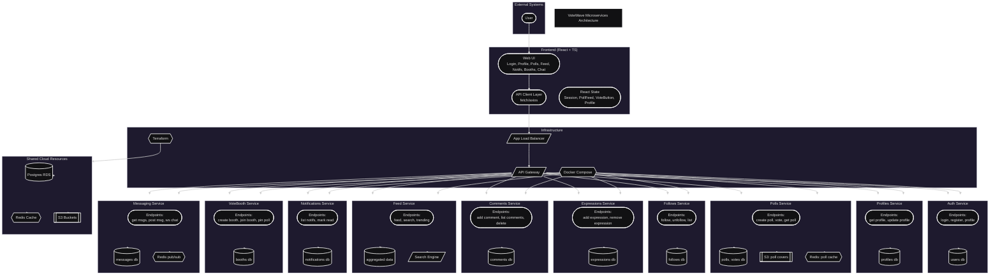

# VoteWave : Cloud-Native Polling App
<p align="center">
  <!-- Project Status -->
  &nbsp;&nbsp;

  <!-- Contributions -->
  <a href="https://github.com/MrCh0p808/AnnaSewa?tab=readme-ov-file#-contribution">
  
  </a>&nbsp;&nbsp;
  <!-- LinkedIn -->
  <a href="https://www.linkedin.com/in/trideev-ganguly/">
    
  </a>&nbsp;&nbsp;
  <!-- LICENSE -->
  <a href="https://github.com/MrCh0p808/VoteWave/blob/main/LICENSE]">
    
  </a>&nbsp;&nbsp;
  <!-- Made With Love -->
  <a href="https://img.shields.io/badge/Made%20with-❤️-red.svg">
    
  </a>&nbsp;&nbsp;
</p>
<p align="center">
  <!-- Frontend -->
  <a href="https://react.dev/">
    
  </a>
  <!-- Backend -->
  <a href="https://www.python.org/doc/">
    
  </a>
  <a href="https://fastapi.tiangolo.com/">
    
  </a>
  <a href="#">
    
  </a>
  <!-- Cloud + Infra -->
  <a href="https://aws.amazon.com/">
    
  </a>
  <a href="https://aws.amazon.com/">
    
  </a>
  <a href="https://docs.aws.amazon.com/eks/">
    
  </a>
  <a href="https://developer.hashicorp.com/terraform/docs">
    
  </a>
  <a href="https://docs.docker.com/">
    
  </a>
  <a href="https://kubernetes.io/docs/">
    
  </a>
  <a href="https://docs.github.com/en/actions">
    
  </a>

  <!-- Monitoring -->
  <a href="https://docs.aws.amazon.com/cloudwatch/">
    
  </a>
  <a href="https://grafana.com/docs/">
    
  </a>
</p>

---

Welcome to **VoteWave**, my *Dhaansu* Terraform project for deploying a cloud-native polling/voting app on **AWS EC2** and **RDS Postgres**!  
This repo automates the **entire infrastructure lifecycle**, from networking and security to compute, storage, and schema initialization.

---

## 📂 What's Inside?

- 📖 **[STORY.md](docs/STORY.md)** – The journey and inspiration behind VoteWave  
- ⚙️ **[SETUP.md](docs/SETUP.md)** – Step-by-step setup and deployment guide  
- 📑 **[DOCS.md](docs/DOCS.md)** – Phase-wise development and infrastructure documentation  

---
## Architechture
As Per : September-October 2025


---
## End-To-End Request Life-Cycle

```mermaid
---
config:
  theme: dark
---
sequenceDiagram
    autonumber
    participant U as 👤 User
    participant UI as 🖥️ Web UI (React)
    participant ALB as ⚖️ ALB (Load Balancer)
    participant APIGW as 🚪 API Gateway
    participant AUTH as 🔐 Auth Service
    participant PROFILES as 🗂️ Profiles Service
    participant POLLS as 📊 Polls Service
    participant FOLLOWS as 🔗 Follows Service
    participant EXPR as 🌊 Expressions Service
    participant COMMENTS as 💬 Comments Service
    participant FEED as 📰 Feed Service
    participant NOTIFS as 🔔 Notifications Service
    participant BOOTH as 🏛️ VoteBooth Service
    participant MSG as 💬 Messaging Service
    participant RDS as 🐘 DB (Postgres)
    participant REDIS as ⚡ Cache (Redis)
    participant S3 as 🪣 Storage (S3)
    participant SEARCH as 🔍 Search Engine
    U->>UI: Submit login/register
    UI->>ALB: HTTP request
    ALB->>APIGW: Forward
    APIGW->>AUTH: /login or /register
    AUTH->>RDS: Verify/insert user
    RDS-->>AUTH: userId + token
    AUTH-->>APIGW: Auth success
    APIGW-->>UI: Return token
    UI->>U: Session stored
    U->>UI: Update profile
    UI->>ALB: API call
    ALB->>APIGW: Forward
    APIGW->>PROFILES: /profiles
    PROFILES->>RDS: Update profiles table
    PROFILES-->>APIGW: Success
    APIGW-->>UI: Profile updated
    UI->>U: Profile refreshed
    U->>UI: Create poll (Q + options + cover)
    UI->>ALB: API call
    ALB->>APIGW: Forward
    APIGW->>POLLS: /createPoll
    POLLS->>RDS: Insert poll
    POLLS->>S3: Upload cover
    POLLS-->>APIGW: pollId returned
    APIGW-->>UI: Poll created
    UI->>U: Poll visible
    U->>UI: Cast vote
    UI->>ALB: API call
    ALB->>APIGW: Forward
    APIGW->>POLLS: /vote
    POLLS->>RDS: Insert vote
    POLLS->>REDIS: Update poll cache
    POLLS-->>APIGW: Vote success
    APIGW-->>UI: Updated results
    UI->>U: Vote shown
    U->>UI: Add expression
    UI->>ALB: API call
    ALB->>APIGW: Forward
    APIGW->>EXPR: /expressions
    EXPR->>RDS: Insert expression
    EXPR-->>APIGW: Saved
    APIGW-->>UI: Update UI
    UI->>U: Expression visible
    U->>UI: Post comment
    UI->>ALB: API call
    ALB->>APIGW: Forward
    APIGW->>COMMENTS: /comments
    COMMENTS->>RDS: Insert comment
    COMMENTS-->>APIGW: Saved
    APIGW-->>UI: Display comment
    UI->>U: Comment visible
    U->>UI: Follow user
    UI->>ALB: API call
    ALB->>APIGW: Forward
    APIGW->>FOLLOWS: /follows
    FOLLOWS->>RDS: Insert follow
    FOLLOWS-->>APIGW: Success
    APIGW-->>UI: Follow confirmed
    UI->>U: Feed connections updated
    U->>UI: Open feed
    UI->>ALB: API call
    ALB->>APIGW: Forward
    APIGW->>FEED: /feed
    FEED->>RDS: Query polls/follows/expr
    FEED->>SEARCH: Run text search
    FEED->>S3: Get media
    FEED-->>APIGW: Feed data
    APIGW-->>UI: Deliver feed
    UI->>U: Personalized feed
    NOTIFS->>RDS: Insert notif (wave/comment/follow)
    U->>UI: Check notifs
    UI->>ALB: API call
    ALB->>APIGW: Forward
    APIGW->>NOTIFS: /notifications
    NOTIFS->>RDS: Fetch notifs
    NOTIFS-->>APIGW: List returned
    APIGW-->>UI: Deliver notifs
    UI->>U: Notifs visible
    U->>UI: Join booth
    UI->>ALB: API call
    ALB->>APIGW: Forward
    APIGW->>BOOTH: /booths/join
    BOOTH->>RDS: Update booth_members
    BOOTH-->>APIGW: Join confirmed
    APIGW-->>UI: Booth joined
    UI->>U: Booth page refreshed
    U->>UI: Send booth message
    UI->>ALB: WS/HTTP request
    ALB->>APIGW: Forward
    APIGW->>MSG: /messages or WS
    MSG->>MDB: Save message
    MSG->>REDIS: Publish event
    MSG-->>APIGW: Ack
    APIGW-->>UI: Message delivered
    UI->>U: Chat updated

```

---
## 🚀 Quickstart

Make sure you have [Terraform](https://www.terraform.io/downloads) installed and your AWS credentials configured.

### Apply infrastructure
Now, provision the core application infrastructure. This process is fully automated and does not require you to provide any passwords manually.

```bash
# Navigate to the main infrastructure directory
cd infra/

# Initialize Terraform to connect to your remote S3 backend
terraform init

# Apply the configuration to build the infrastructure
# No variables are needed.
terraform apply --auto-approve
```
### Retrieve the Generated Database Password
The infrastructure now uses AWS Secrets Manager and a randomly generated password for maximum security. To view the new password for manual inspection or testing, you can use the output command: 

```bash
# This will display the generated password
terraform output -sensitive db_password
```
## ⚡ Recommended Setup

### Export AWS Credentials
```bash
export AWS_ACCESS_KEY_ID="your_access_key"
export AWS_SECRET_ACCESS_KEY="your_secret_key"
```

Ensure your local machine has Terraform installed (terraform -v).

Follow **[SETUP.md](docs/SETUP.md)** for detailed deployment instructions.

## MicroServices At Glance

## STANDARDS & API GUIDELINES


## 🤝 Contributing

- Got ideas or improvements?
- Fork the repo
- Create a new branch
- Submit a PR 🎉
- Or ping me directly on LinkedIn [Trideev Ganguly](https://www.linkedin.com/in/trideev-ganguly/) to discuss the project!

## 📜 License

This project is open-source under the [MIT LICENSE](LICENSE)
.

## 🔖 Tags


