# VoteWave : Cloud-Native Polling App

[](https://www.terraform.io/)
[](https://aws.amazon.com/)
[](LICENSE)
[]()

---

Welcome to **VoteWave**, my *Dhaansu* Terraform project for deploying a cloud-native polling/voting app on **AWS EC2** and **RDS Postgres**!  
This repo automates the **entire infrastructure lifecycle**, from networking and security to compute, storage, and schema initialization.

---

## 📂 What's Inside?

- 📖 **[STORY.md](Docs/STORY.md)** – The journey and inspiration behind VoteWave  
- ⚙️ **[SETUP.md](Docs/SETUP.md)** – Step-by-step setup and deployment guide  
- 📑 **[DOCS.md](Docs/DOCS.md)** – Phase-wise development and infrastructure documentation  

---
## Architechture
#Terraform #AWS #InfrastructureAsCode #CloudNative #VotingApp

# Sprint Plan ( September-October 2025 )

```mermaid
---
config:
  theme: mc
---
flowchart LR
  subgraph subGraph0["External Systems"]
    User["👤 User"]
  end
  subgraph Frontend["Frontend"]
    UI["Web UI"]
  end
  subgraph subGraph2["Infrastructure & Operations"]
    direction LR
    TF("🔧 Terraform")
    Docker("🔧 Docker")
  end
  subgraph subGraph3["Public Subnet"]
    ALB("Application Load Balancer")
    API_GW("API Gateway")
  end
  subgraph Auth_Service["Auth Service"]
    Auth_Login_Register("Authentication & Registration")
    Auth_Profile("User Profiles")
    DB_Auth[("User Data DB")]
  end
  subgraph Polls_Service["Polls Service"]
    Polls_Core("Polls Core")
    Polls_Expressions("Expressions (Waves/Ripples)")
    Polls_Comments("Comments")
    DB_Polls[("Polls Data DB")]
    Redis_Cache(("Redis Cache"))
  end
  subgraph Content_Service["Content Service"]
    Content_Feed("Personalized Feeds & Discovery")
    Content_Follows("Follows & Connections")
    Content_Notifications("Notifications")
    Content_Media("Media Uploads")
    DB_Content[("User Connections DB")]
    S3_Bucket[("S3 Bucket")]
  end
  subgraph subGraph4["VoteWave Microservices"]
    Auth_Service
    Polls_Service
    Content_Service
  end
  subgraph VPC["VPC"]
    subGraph3
    subGraph4
  end
  subgraph subGraph7["AWS Cloud"]
    VPC
    RDS[("PostgreSQL RDS")]
    S3[("S3 Bucket")]
    Redis(("Redis Cache"))
  end
  Auth_Login_Register --> DB_Auth
  Auth_Profile --> DB_Auth
  Polls_Core -- Reads/Writes --> DB_Polls
  Polls_Expressions -- Writes --> DB_Polls
  Polls_Comments -- Writes --> DB_Polls
  Polls_Core -- Caches --> Redis_Cache
  Content_Follows --> DB_Content
  Content_Notifications --> DB_Content
  Content_Media -- Uploads --> S3_Bucket
  API_GW -- Authenticates & Routes --> Auth_Service
  API_GW -- Routes --> Polls_Service & Content_Service
  Auth_Service --> RDS
  Polls_Service --> RDS
  Content_Service --> RDS
  Content_Service -- Reads/Writes --> S3_Bucket
  Polls_Service -- Caches --> Redis_Cache
  User -- Requests --> UI
  UI -- API Calls --> ALB
  ALB -- Routes Traffic --> API_GW
  TF -- Provisions Infrastructure --> subGraph7
  Docker -- Manages Containers --> Auth_Service & Polls_Service & Content_Service
  classDef user fill:#404040,stroke:#808080
  classDef frontend fill:#404040,stroke:#808080
  classDef gateway fill:#404040,stroke:#808080
  classDef backend fill:#404040,stroke:#808080
  classDef db fill:#404040,stroke:#808080
  classDef storage fill:#404040,stroke:#808080
  classDef cache fill:#404040,stroke:#808080
  classDef ops fill:#404040,stroke:#808080
  classDef application fill:#f0f8ff,stroke:#000
  style User color:#FFFFFF
  style UI color:#FFFFFF
  style TF color:#FFFFFF
  style Docker color:#FFFFFF
  style ALB color:#FFFFFF
  style API_GW color:#FFFFFF
  style RDS color:#FFFFFF
  style S3 color:#FFFFFF
  style Redis color:#FFFFFF
  style subGraph4 fill:#303030,stroke:#808080,stroke-width:2px
  style Auth_Service fill:#505050,stroke:#A0A0A0
  style Polls_Service fill:#505050,stroke:#A0A0A0
  style Content_Service fill:#505050,stroke:#A0A0A0
  style subGraph0 fill:#505050,stroke:#A0A0A0
  style Frontend fill:#505050,stroke:#A0A0A0
  style subGraph2 fill:#505050,stroke:#A0A0A0
  style subGraph3 fill:#505050,stroke:#A0A0A0
  style VPC fill:#505050,stroke:#A0A0A0
  style subGraph7 fill:#505050,stroke:#A0A0A0
  linkStyle 0 stroke:#FFFFFF,stroke-width:2px,fill:none
  linkStyle 1 stroke:#FFFFFF,stroke-width:2px,fill:none
  linkStyle 2 stroke:#FFFFFF,stroke-width:2px,fill:none
  linkStyle 3 stroke:#FFFFFF,stroke-width:2px,fill:none
  linkStyle 4 stroke:#FFFFFF,stroke-width:2px,fill:none
  linkStyle 5 stroke:#FFFFFF,stroke-width:2px,fill:none
  linkStyle 6 stroke:#FFFFFF,stroke-width:2px,fill:none
  linkStyle 7 stroke:#FFFFFF,stroke-width:2px,fill:none
  linkStyle 8 stroke:#FFFFFF,stroke-width:2px,fill:none
  linkStyle 9 stroke:#FFFFFF,stroke-width:2px,fill:none
  linkStyle 10 stroke:#FFFFFF,stroke-width:2px,fill:none
  linkStyle 11 stroke:#FFFFFF,stroke-width:2px,fill:none
  linkStyle 12 stroke:#FFFFFF,stroke-width:2px,fill:none
  linkStyle 13 stroke:#FFFFFF,stroke-width:2px,fill:none
  linkStyle 14 stroke:#FFFFFF,stroke-width:2px,fill:none
  linkStyle 15 stroke:#FFFFFF,stroke-width:2px,fill:none
  linkStyle 16 stroke:#FFFFFF,stroke-width:2px,fill:none
  linkStyle 17 stroke:#FFFFFF,stroke-width:2px,fill:none
  linkStyle 18 stroke:#FFFFFF,stroke-width:2px,fill:none
  linkStyle 19 stroke:#FFFFFF,stroke-width:2px,fill:none
  linkStyle 20 stroke:#FFFFFF,stroke-width:2px,fill:none

```


---

## 🚀 Quickstart

Make sure you have [Terraform](https://www.terraform.io/downloads) installed and your AWS credentials configured.

### Apply infrastructure
Now, provision the core application infrastructure. This process is fully automated and does not require you to provide any passwords manually.

```bash
# Navigate to the main infrastructure directory
cd infra/

# Initialize Terraform to connect to your remote S3 backend
terraform init

# Apply the configuration to build the infrastructure
# No variables are needed.
terraform apply --auto-approve
```
### Retrieve the Generated Database Password
The infrastructure now uses AWS Secrets Manager and a randomly generated password for maximum security. To view the new password for manual inspection or testing, you can use the output command: 

```bash
# This will display the generated password
terraform output -sensitive db_password
```
## ⚡ Recommended Setup

### Export AWS Credentials
```bash
export AWS_ACCESS_KEY_ID="your_access_key"
export AWS_SECRET_ACCESS_KEY="your_secret_key"
```

Ensure your local machine has Terraform installed (terraform -v).

Follow [SETUP.md](SETUP.md) for detailed deployment instructions.

# VoteWave Microservices Plan
This document outlines the detailed architecture and requirements for new microservices to expand VoteWave into a complete social media platform. It defines the responsibilities of each service, their API endpoints, and their respective database schemas.

## 1. Profiles & Identity Service
This service will handle all user-facing identity information beyond basic authentication.
**Purpose:** To manage and serve public user profiles, including a user's bio, profile picture link, and other public-facing data.

### API Endpoints:
```
GET /api/v1/profiles/{user_id}: Retrieve the public profile of a specific user.
```
**Path Parameter:** user_id (string, required).

**Response:** A JSON object containing user_id, username, bio, profile_pic_url, etc.
```
PUT /api/v1/profiles: Update the authenticated user's profile.
```
**Request Body**: JSON object with fields like bio (string) and profile_pic_url (string).

### Database Schema (PostgreSQL):
```
CREATE TABLE IF NOT EXISTS profiles (
    user_id UUID PRIMARY KEY REFERENCES users(id),
    username VARCHAR(80) UNIQUE NOT NULL,
    bio TEXT,
    profile_pic_url VARCHAR(255),
    created_at TIMESTAMP WITH TIME ZONE DEFAULT CURRENT_TIMESTAMP,
    updated_at TIMESTAMP WITH TIME ZONE DEFAULT CURRENT_TIMESTAMP
);
```
**Dependencies:** auth-service (for user_id and authentication).

## 2. Follows & Connections Service
This service will manage the one-way following relationships between users.

**Purpose:** To track and manage who a user is following and who is following them, providing the foundation for a personalized feed.

### API Endpoints:
```
POST /api/v1/follows/{followed_id}: Authenticated user follows another user.
```
**Path Parameter:** followed_id (string, required).
**Response:** 201 Created on success.
```
DELETE /api/v1/follows/{followed_id}: Authenticated user unfollows another user.
```
**Path Parameter:** followed_id (string, required).
**Response:** 204 No Content on success.
```
GET /api/v1/follows/followers/{user_id}: Get a list of users following a given user.
```
```
GET /api/v1/follows/following/{user_id}: Get a list of users a given user is following.
```
### Database Schema (PostgreSQL):
```
CREATE TABLE IF NOT EXISTS follows (
    follower_id UUID REFERENCES users(id),
    followed_id UUID REFERENCES users(id),
    created_at TIMESTAMP WITH TIME ZONE DEFAULT CURRENT_TIMESTAMP,
    PRIMARY KEY (follower_id, followed_id)
);
```
**Dependencies**: auth-service.

## 3. The Expression Service (Psychological Engagement)
To create an addictive experience, we will replace traditional "likes" with a system based on "Waves" and "Ripples." . A Wave is a powerful, active endorsement of a poll, indicating strong agreement or approval. A Ripple is a softer, passive form of engagement, showing a poll has caught a user's attention without them taking a decisive action.

**Purpose:** To handle all user-generated expressions of feedback on polls and content.

### API Endpoints:
```
POST /api/v1/expressions/{item_id}: An authenticated user creates an expression on a poll or piece of content.
```
**Path Parameter:** item_id (string, required, can be a poll_id or content_id).
**Request Body:** JSON object with expression_type ("wave" or "ripple").
**Response**: 201 Created on success.
```
DELETE /api/v1/expressions/{item_id}: Remove a user's expression.
```
### Database Schema (PostgreSQL):
```
CREATE TABLE IF NOT EXISTS expressions (
    id SERIAL PRIMARY KEY,
    user_id UUID REFERENCES users(id),
    item_id UUID, -- References poll_id or content_id
    expression_type VARCHAR(10) NOT NULL CHECK (expression_type IN ('wave', 'ripple')),
    created_at TIMESTAMP WITH TIME ZONE DEFAULT CURRENT_TIMESTAMP
);
```
**Dependencies:** auth-service, polls-service, content-service.

## 4. Comments Service
This service will manage all user comments on polls and content.
**Purpose:** To enable threaded discussions and user-to-user communication.

### API Endpoints:
```
POST /api/v1/comments/{item_id}: Post a new comment on a poll or content.
```
**Request Body:** JSON object with comment_text (string).
```
GET /api/v1/comments/{item_id}: Retrieve all comments for a specific poll or content item.
DELETE /api/v1/comments/{comment_id}: Delete a comment (by the author or poll owner).
```

Database Schema (PostgreSQL):
```
CREATE TABLE IF NOT EXISTS comments (
    id UUID PRIMARY KEY,
    user_id UUID REFERENCES users(id),
    item_id UUID NOT NULL, -- References poll_id or content_id
    comment_text TEXT NOT NULL,
    created_at TIMESTAMP WITH TIME ZONE DEFAULT CURRENT_TIMESTAMP
);
```
**Dependencies:** auth-service, polls-service, content-service.

## 5. Feed & Discovery Service
This service is the heart of the social media experience, handling personalized content delivery and search.
**Purpose:** To generate a user's personalized feed, provide search functionality, and manage trends.

### API Endpoints:
```
GET /api/v1/feed: Retrieve the authenticated user's personalized feed.
```
Query Parameters: page (integer), limit (integer).
```
GET /api/v1/search: Search for users, polls, or hashtags.
```
Query Parameters: q (string, required), type (e.g., "users", "polls").
```
GET /api/v1/explore/trending: Get a list of currently trending polls.
```
### Business Logic:

**Feed Generation:** The logic will involve a combination of content from followed users, popular content from the broader network, and content based on the user's past engagement (polls they've interacted with).
**Search Indexing:** The service will need to use a search-optimized database (like Elasticsearch) or a full-text search engine within PostgreSQL to handle efficient searches.
**Dependencies**: auth-service, polls-service, content-service, follows-service.

## 6. Notifications Service
This service will manage all user notifications.
**Purpose**: To send real-time and push notifications to users about relevant events.

### **API Endpoints:**
```
GET /api/v1/notifications: Retrieve the authenticated user's notifications.

POST /api/v1/notifications/mark-read: Mark specific or all notifications as read.
```
### Database Schema (PostgreSQL):
```
CREATE TABLE IF NOT EXISTS notifications (
    id UUID PRIMARY KEY,
    recipient_user_id UUID REFERENCES users(id),
    sender_user_id UUID REFERENCES users(id),
    notification_type VARCHAR(50) NOT NULL, -- e.g., 'new_follower', 'wave_on_poll', 'comment_on_poll'
    content_id UUID, -- The item the notification is about (poll_id, comment_id, etc.)
    is_read BOOLEAN DEFAULT FALSE,
    created_at TIMESTAMP WITH TIME ZONE DEFAULT CURRENT_TIMESTAMP
);
```

## 🤝 Contributing

- Got ideas or improvements?
- Fork the repo
- Create a new branch
- Submit a PR 🎉
- Or ping me directly on LinkedIn [Trideev Ganguly](https://www.linkedin.com/in/trideev-ganguly/) to discuss the project!

## 📜 License

This project is open-source under the [MIT LICENSE](LICENSE)
.

## 🔖 Tags


