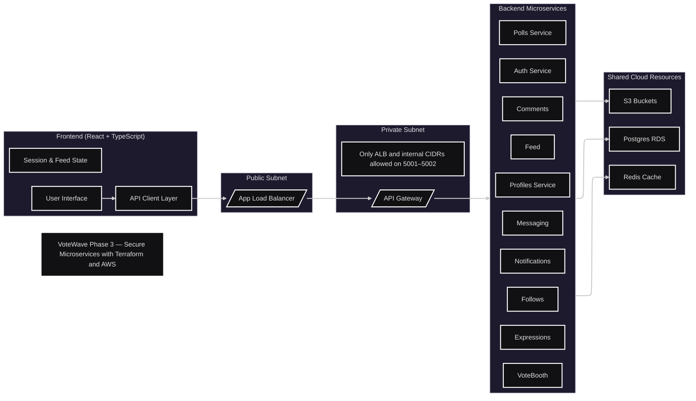
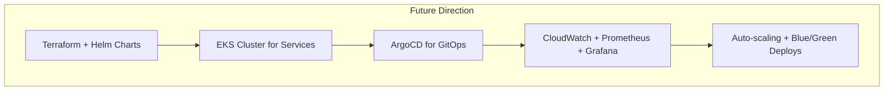

# 📘 VoteWave Phase-Wise Documentation

This file tells the story of how VoteWave has grown, from a single Flask app to a full-fledged cloud-native polling system.  
Each phase built upon the lessons and code from the last, keeping the vision clear: **build something fast, secure, and self-healing**.

---

# 🌱 Phase 1: The Monolithic Foundation

## 🎯 Goal
Get something working.  
A simple monolith, deployed manually to the cloud, to prove the idea and start the DevOps journey.

## 🏗️ Architecture
```mermaid
graph TD
    subgraph "Developer Workflow"
        A[Developer on Local Machine] --> B{Manual Deployment}
    end
    B --> C(Deploys To)
    subgraph "AWS Cloud (Managed by TF)"
        D[EC2 Instance] -->|contains| E[Docker Container]
        E -->|runs| F[Flask App - VoteWave Monolith]
        F -->|stores data in| G[In-Memory DB]
    end
    C --> D
````

## ✅ What Happened

* Terraform bootstrapped one EC2 instance with a custom VPC and security groups.
* The app was a plain Python Flask monolith running in Docker.
* All logic (users, polls, votes) lived in a single codebase.
* Data existed in an in-memory store, so a restart wiped everything.
* Deployment was a ritual: SSH → git clone → docker build/run.
  This became the baseline to measure every automation that came later.

---

# 🌊 Phase 2: Microservices, CI/CD, and Cloud Foundation

## 🎯 Goal

Split the monolith, add a real database, and automate builds and image delivery.

## 🏗️ Architecture

```mermaid
graph TD
    subgraph "CI/CD Flow"
        A[Developer: git push] --> B{GitHub Actions}
        B --> C[Build Docker Images]
        C --> D[Tag with Git SHA]
        D --> E[Push to AWS ECR]
    end

    subgraph "Cloud Environment (via Terraform)"
        F[AWS ECR - Container Registry]
        G[AWS RDS - PostgreSQL]
        H[AWS Secrets Manager - DB Password]
        I[S3 + DynamoDB - Remote State & Locking]
    end

    E --> F
```

## ✅ What Changed

* The monolith was split into **auth-service** and **polls_service**.
* PostgreSQL RDS replaced in-memory data.
* GitHub Actions took over CI, building and tagging images on every push.
* AWS Secrets Manager began storing credentials safely.
* Terraform’s state moved to S3 with DynamoDB locking.

## 🔐 Security and Structure

* Only the developer’s current IP could SSH into EC2.
* Secrets were removed from code and injected at runtime.
* The pipeline stopped deploying- it only built and tested.
  This shift separated “integration” from “deployment,” paving the way for orchestration.

---

# ☁️ Phase 3: Cloud-Native Infrastructure (Current)

## 🎯 Goal

Run VoteWave as a **true multi-service app** on AWS with Terraform automation, secure networking, and shared resources.

## 🧱 Core Idea

Every service has its own container and API.
They all talk through a controlled private network behind an Application Load Balancer and API Gateway.

## 🏗️ Architecture



## ⚙️ What’s New

* **Terraform now provisions everything** : from VPCs to DB passwords.
* Backend ingress ports (5001, 5002) are limited to the current public IP.
* DB URLs are **auto-generated** from RDS attributes (no more hardcoded secrets).
* AWS Secrets Manager holds all passwords securely.
* Services are isolated but share Redis, RDS, and S3.
* CI/CD remains via GitHub Actions, but deployment can target any infra — even EKS.

## 📦 Services Overview

Each module (auth, polls, comments, feed, etc.) is independent, containerized, and communicates through REST APIs.
This makes the system modular, fault-tolerant, and easier to scale.

## 🔍 Observability

CloudWatch and Grafana monitor logs and metrics.
Every log follows a structured JSON format for easier debugging and alerting.

---

# 🛰️ Phase 4: Toward Kubernetes and Self-Healing Systems

## 🎯 Goal

Move from manually orchestrated EC2 containers to **AWS EKS** and achieve **true GitOps**.

## 🧭 Roadmap Preview



## 🌐 Expected Gains

* Declarative deployments via Helm.
* Rollbacks and progressive delivery.
* Separate namespaces for staging and production.
* Self-healing pods, horizontal scaling, and live metrics.

Phase 4 will turn VoteWave into a **production-grade, multi-region polling platform**.

---

# 🧩 Summary

| Phase | Focus        | What It Achieved                                                          |
| ----- | ------------ | ------------------------------------------------------------------------- |
| 1     | Baseline     | Single Flask app, manual deploy, Terraform EC2                            |
| 2     | CI/CD        | Split services, RDS, GitHub Actions, ECR                                  |
| 3     | Cloud-Native | Multi-service infra with Terraform, secrets automation, secure networking |
| 4     | Kubernetes   | GitOps, self-healing, auto-scaling, observability                         |

---

# 💬 Closing Note

VoteWave grew from a single Python file into a network of services that can run anywhere.
Each phase is kept in this document not for nostalgia, but to remind us that good systems grow *step by step*, not overnight.

```
---

Would you like me to now update your `SETUP.md` in the same human, Phase-aware tone to match this DOCS format (including Terraform + Secrets steps)?
```
