```mermaid
flowchart TD
    TF["Terraform Apply"] --> AWS["AWS Cloud"]
    AWS --> Net["🏗 VPC + Subnets"]
    AWS --> DB["🐘 RDS"]
    AWS --> S3["🪣 S3 Buckets"]
    AWS --> SEC["🔐 Secrets Manager"]
    TF --> Out["📄 Outputs (db + alb)"]
```

```mermaid
graph TD
    User["👤 Browser User"] --> ALB["⚖️ ALB"]
    ALB --> GW["🚪 API Gateway"]
    GW --> Services["Microservices in Private Subnets"]
    Services --> RDS["🐘 Database"]
```

# ⚙️ How to Run VoteWave (Current: Phase 3 - Cloud-Native Setup)

This guide walks through how I now set up and run VoteWave in its current phase, while still remembering how it used to be.  
Every step that once felt manual or brittle now feels like a small script doing the heavy lifting.

---

## 🪴 Looking Back Before We Start

Before we start the setup, here’s a quick memory lane of how things evolved.

```mermaid
flowchart TD
    P1["🌱 Phase 1 : Manual Monolith"]
    P2["🌊 Phase 2 : CI/CD + RDS"]
    P3["☁️ Phase 3 : Cloud-Native Terraform (You Are Here)"]
    P4["🛰️ Phase 4 : Kubernetes & GitOps (Next)"]

    P1 --> P2 --> P3 --> P4
````

* **Phase 1:** I SSH’d into an EC2 instance, cloned the repo, and ran Docker by hand.
* **Phase 2:** CI/CD and RDS arrived, but Terraform was still partial.
* **Phase 3 (Now):** Terraform provisions everything  - VPC, subnets, RDS, secrets, load balancer, and images.
* **Phase 4 (Coming):** Shift to EKS and GitOps for self-healing deployments.

---

## ✅ Prerequisites

What you need before starting:

* AWS account with IAM access to EC2, RDS, S3, Secrets Manager
* AWS CLI configured using `aws configure`
* Terraform installed (`terraform -v`)
* Git installed
* Optional: Docker + Docker Compose for local runs

Back in Phase 1 I had to keep passwords in `.env` files and open ports manually.
Now Terraform and Secrets Manager handle that automatically.

```mermaid
graph LR
    Dev["🧑‍💻 Developer Machine"] --> CLI["AWS CLI Configured"]
    CLI --> TF["Terraform Installed"]
    TF --> Ready["✅ Environment Ready"]
```

---

## 🚀 Step 1 – Clone the Repository

Grab the latest source.

```bash
git clone https://github.com/MrCh0p808/VoteWave.git
cd VoteWave
```


---

## 🧱 Step 2 – Initialize the Infrastructure

Earlier I had to launch EC2 instances by hand.
Now a single Terraform apply creates the full stack.

```bash
cd infra/
terraform init
terraform apply --auto-approve
```

This sets up:

* VPC + Subnets + Security Groups
* EC2 instances (if defined)
* RDS PostgreSQL
* S3 for assets and Terraform state
* Secrets Manager entries for passwords and keys

When done you’ll see outputs like:

```bash
db_endpoint = "votewave-db.xxxxxx.ap-south-1.rds.amazonaws.com"
alb_dns = "votewave-alb-xxxxxx.elb.amazonaws.com"
```



---

## 🔐 Step 3 – Retrieve Secrets

All secrets are generated automatically and stored safely.

```bash
terraform output -sensitive
```

or through AWS CLI:

```bash
aws secretsmanager get-secret-value --secret-id votewave-db-password
```

No more plain-text `.env` files like in Phase 1 and 2.

```mermaid
graph TD
    SM["🔐 Secrets Manager"] --> RDS["RDS Instance"]
    SM --> Services["Auth / Polls Containers"]
    note["Terraform creates and rotates passwords for you"]
```



---

## 🧰 Step 4 – Set Up CI/CD (GitHub Actions)

In Phase 2 I configured Jenkins manually.
Now GitHub Actions does everything when I push to `main`.

Add these repository secrets:

```bash
AWS_ACCESS_KEY_ID        = your_aws_access_key
AWS_SECRET_ACCESS_KEY    = your_aws_secret_key
AWS_ACCOUNT_ID           = your_aws_account_id
```

Push to trigger the build:

```bash
echo "# test" >> README.md
git add .
git commit -m "chore: trigger build"
git push origin main
```


---

## 🧪 Step 5 – Local Development (Optional)

Sometimes I still test locally before deploying.

```bash
cd backend/
docker-compose up --build
```

This launches Auth and Polls services with a local Postgres.
It mirrors AWS minus Terraform and Secrets Manager.

```mermaid
graph TD
    Dev["🧑‍💻 Local Machine"] --> Docker["🐳 Docker Compose"]
    Docker --> Auth["Auth Service"]
    Docker --> Polls["Polls Service"]
    Auth --> LocalDB["Local Postgres"]
    Polls --> LocalDB
```



---

## 🌐 Step 6 – Access the App

Once Terraform finishes, fetch the ALB DNS:

```bash
terraform output alb_dns
```

Open it in a browser or hit the API directly:

```bash
curl http://<alb_dns>:5001/api/v1/polls
```



---

## 🛰️ Step 7 – Clean Up (When Done)

Terraform can remove everything neatly.

```bash
terraform destroy --auto-approve
```

It deletes RDS, S3, Secrets, and networking resources safely.

```mermaid
graph TD
    TF["Terraform Destroy"] --> AWS["AWS Cloud"]
    AWS --> Removed["💨 All Resources Deleted"]
    Removed --> Bill["🧾 No Extra Charges"]
```



---

## 🧭 Visual Overview of Setup Flow

```mermaid
flowchart TD
    A["🧑‍💻 Developer Environment"] --> B["Clone Repo & Prepare AWS CLI"]
    B --> C["Initialize Terraform"]
    C --> D["Terraform Applies Infrastructure"]
    D --> E["AWS Resources (VPC, EC2, RDS, S3, Secrets)"]
    E --> F["GitHub Actions Builds Docker Images"]
    F --> G["ECR Stores Tagged Images"]
    G --> H["ALB + API Gateway Route Traffic"]
    H --> I["Microservices in Private Subnets"]
    I --> J["RDS + Redis + S3 Shared Resources"]
    J --> K["CloudWatch + Grafana Monitor"]
    K --> L["End User Access via Browser"]
    L --> M["✅ Cloud-Native VoteWave Running"]
```



---

## 🕰️ From Manual to Automatic – How Setup Changed


* **Phase 1:** manual EC2 setup and Docker run.
* **Phase 2:** CI/CD pipeline built images, RDS connected.
* **Phase 3:** Terraform and Secrets Manager handle everything automatically.

Each phase shaved off one more manual step.

---

## 💬 Final Notes

* Secrets are created and rotated automatically.
* Everything is reproducible  - destroy and apply any time.
* If something fails, rerun Terraform; it self-reconciles.
* Phase 4 will move this setup to EKS with GitOps.

```mermaid
graph TD
    P3["☁️ Current Phase 3 – Terraform + AWS"]
    P4["🚀 Next Phase 4 – EKS + ArgoCD"]
    P3 --> P4
```



VoteWave’s setup journey taught me patience.
Every automation I wrote replaced one of my old mistakes.
Now, with Terraform doing the heavy lifting, I can finally say this infrastructure almost runs itself.

```


