# 🧩 VoteWave : The Architecture Story

This file narrates the evolution of VoteWave from a simple monolith into a living, cloud-native system.  
Each phase carries its own lessons, scars, and small wins that shaped the current infrastructure.

---

# 🌱 Phase 1 - The Seed (Monolith Days)

The project started as one Python Flask file running on a single EC2 instance.  
It had no secrets manager, no CI/CD, and no database, just raw curiosity.

```mermaid
flowchart TD
    Dev["👩‍💻 Developer"] -->|SSH + Docker Build| EC2["AWS EC2"]
    EC2 --> APP["Flask Monolith Container"]
    APP --> MEM["In-Memory Dict as DB"]
    MEM -.-> LOST["Data Gone on Restart"]
    subgraph Terraform["Terraform Basics"]
        VPC["VPC + Subnet + SG"]
        EC2
    end
````

**Takeaway:** it worked. It proved the idea. That was enough to move on.

---

# 🌊 Phase 2 - Breaking the Monolith

Once stability came, automation followed.
Phase 2 focused on CI/CD, versioned containers, and real persistence.

```mermaid
flowchart TD
    Dev["👨‍💻 git push"] --> GH["GitHub Actions"]
    GH --> Build["Docker Build + Tag (Git SHA)"]
    Build --> ECR1["ECR Repo Auth"]
    Build --> ECR2["ECR Repo Polls"]
    ECR1 --> EC2A["EC2 Instance A"]
    ECR2 --> EC2B["EC2 Instance B"]
    EC2A --> RDS["RDS PostgreSQL DB"]
    EC2B --> RDS
    RDS --> SM["Secrets Manager – Password"]
    subgraph IaC["Terraform Infra"]
        VPC["Custom VPC + Subnets"]
        SG["Security Groups"]
        S3["Remote State Bucket"]
        DDB["State Lock Table"]
    end
    IaC --> EC2A
    IaC --> RDS
    IaC --> SG
```

**What changed**

* Split into two services → `auth-service` and `polls_service`.
* RDS replaced the in-memory store.
* GitHub Actions built and pushed images automatically.
* Terraform backend migrated to S3 + DynamoDB.
* The pipeline stopped deploying directly, it only built.

This shift separated *integration* from *deployment*, preparing for orchestration.

---

# ☁️ Phase 3 - Cloud-Native Infrastructure (Current)

This is where VoteWave truly became a system.
Every service lives in its own container, Terraform provisions everything, and the network is secure by design.

```mermaid

flowchart LR
    subgraph FE["🌐 Frontend (React + TypeScript)"]
        UI["Web UI"]
        API["API Client"]
    end

    subgraph PUB["Public Subnet"]
        ALB[/"Application Load Balancer"/]
    end

    subgraph PRIV["Private Subnet"]
        APIGW[/"API Gateway"/]
        SGNOTE["Ports 5001–5002 only from ALB or VPC CIDR"]
    end

    subgraph SRV["Backend Microservices"]
        AUTH["🔐 Auth"]
        PROF["👤 Profiles"]
        POLL["📊 Polls"]
        FOL["🔗 Follows"]
        EXPR["🌊 Expressions"]
        COMM["💬 Comments"]
        FEED["📰 Feed"]
        NOTIF["🔔 Notifications"]
        BOOTH["🏛️ VoteBooth"]
        MSG["💭 Messaging (WS + Redis Pub/Sub)"]
    end

    subgraph DATA["Shared Resources"]
        RDS["🐘 Postgres RDS"]
        REDIS["⚡ Redis Cache"]
        S3["🪣 S3 Buckets"]
    end

    UI --> API --> ALB --> APIGW
    APIGW --> SRV
    SRV --> RDS
    SRV --> REDIS
    SRV --> S3
    caption["VoteWave Phase 3 — Terraform-Managed Cloud with Secure Private Network"]
```



**Key highlights**

* Terraform controls **networking, compute, storage, and secrets**.
* RDS passwords are generated automatically and stored in AWS Secrets Manager.
* The backend CIDR is restricted; ports 5001 & 5002 open only to ALB.
* Docker Compose helps local testing; AWS ALB + API Gateway handle live traffic.
* Shared Redis/S3 provide caching and storage.
* Monitoring through CloudWatch and Grafana keeps visibility high.

**Lifecycle in simple terms**

A user logs in → ALB routes → API Gateway → Auth Service → RDS → Token back → Feed updates via Redis.
Every request flows inside Terraform-built security walls.

---

# 🚀 Phase 4 - The Horizon (EKS and GitOps)

The next step is orchestration.
Everything learned from Terraform and Docker now prepares VoteWave for Kubernetes.


**Expected outcomes**

* Declarative deployments with Helm.
* Self-healing pods and rolling updates.
* Namespace isolation for staging vs production.
* GitHub Actions → ArgoCD pipeline for full GitOps.

---

# 🧭 Reflection

| Phase | Focus               | Result                                                  |
| ----- | ------------------- | ------------------------------------------------------- |
| 1     | Manual Baseline     | One Flask app on EC2 via Terraform                      |
| 2     | CI/CD Foundation    | Dockerized services + RDS + ECR + Secrets Manager       |
| 3     | Cloud-Native System | Full Terraform stack, private networking, observability |
| 4     | Kubernetes Future   | EKS + GitOps + auto-scaling                             |

VoteWave keeps growing carefully, balancing experimentation with structure.
What began as one container on one instance is now a small ecosystem running in sync, and still humble enough to tell its story.

```
---

