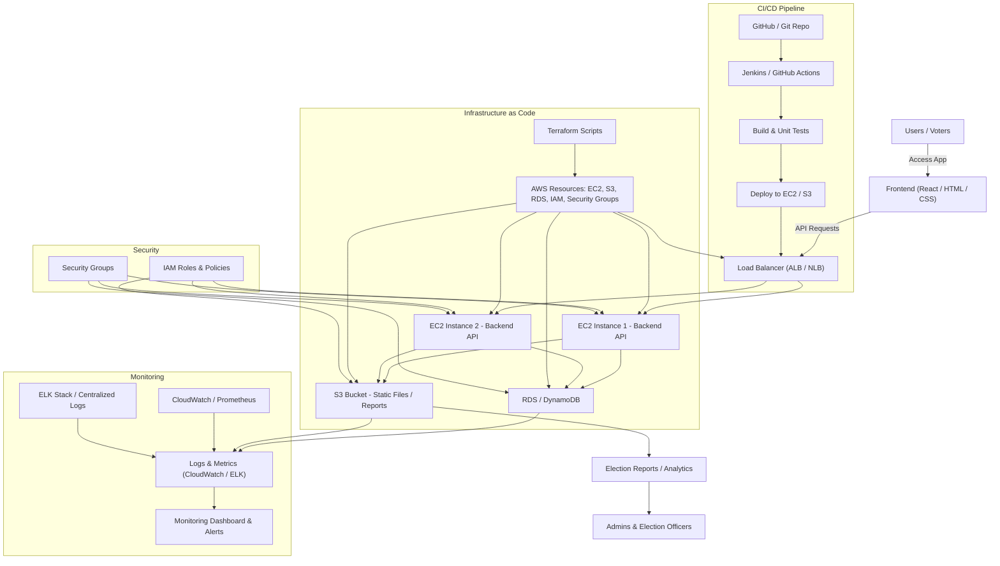
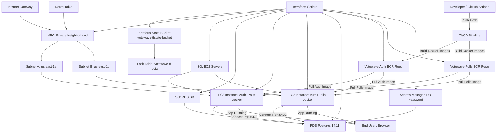

# VoteWave Phase 2 (Current) – Complete Architecture Story

This file represents the **end-to-end story of VoteWave Phase 2**, showing all components, workflows, DevOps pipelines, and monitoring setups.

---

## 🏗️ High-Level Architecture

## VoteWave Phase 2 Infra Story – Mermaid Diagram

Imagine the VoteWave infrastructure as a well-secured, automated house where each component has a role. Here's the visual story of Phase 2.

